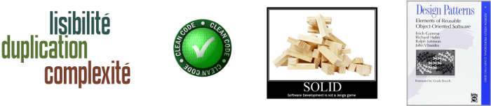
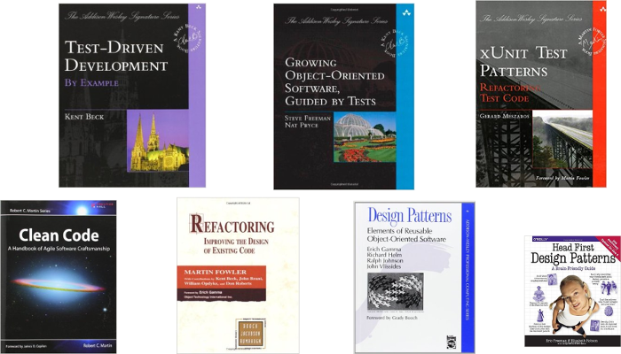

class: center, middle

# Coding Dojo : une aide à la pratique du TDD
### Isabelle BLASQUEZ
---


##TDD (Test Driven Development)
.center[    ]

.center[Itérations « baby-step » rapides (de quelques secondes à quelques minutes)]
   
---

## TDD en pratique
- Pas de code (de production) sans test !  

- Un nouveau test = un nouveau comportement  

- Ecrire au plus vite un code qui fait passer les test

---
## Un test de qualité : Clean Test
- **F**ast

- **I**ndependant

- **R**epeatable

- **S**elf-validating

- **T**imely

---

## Amélioration de la lisibilité du test : pattern AAA

- **A**rrange

- **A**ct

- **A**ssert

```JAVA
	@Test
	public void testShouldReturnHelloWorldWhenNothing() {
		MaClasse monObjet = new MaClasse();
		String resultat = monObjet.maMethodeATester();
		assertEquals("Hello World!", resultat);
	}
````

---
## Exemple simple de TDD 
**Code de Test**
```JAVA
import static org.junit.Assert.*;
import org.junit.Test;

public class TestMaClasse {

	@Test
	public void testShouldReturnHelloWorldWhenNothing() {
		MaClasse monObjet = new MaClasse();
		String resultat = monObjet.maMethodeATester();
		assertEquals("Hello World!", resultat);
	}
}
```

**Code de Production**
```JAVA
public class MaClasse {
	public String maMethodeATester() {
		return "Hello World!";
	}
}
```
---

#Règles de simplicité d'XP
.center[]  

.center[]  

---
#Refactoring pour obtenir un code de qualité

.center[*Un refactoring (remaniement) consiste à changer la structure interne d’un logiciel sans en changer son comportement observable*  
(M. Fowler)]  


.center[]

---
# TDD : une technique de conception (émergente) ?

*The act of writing a unit test is more an act of design than of verification.* 
  
 
*It is also more an act of documentation than of verification* 
  

(Robert. C. Martin)

---
#TDD : une discipline de programmation …
.center[]

---
#... qui demande un entrainement
.center[]

---
# Constat de départ
> Si je veux apprendre le Judo, je vais m’inscrire au dojo du coin et y passer une heure par semaine pendant deux ans, au bout de quoi j’aurai peut-être envie de pratiquer plus assidûment.
>
> Si je veux apprendre la programmation objet, mon employeur va me trouver une formation de trois jours à Java dans le catalogue 2004. 
> 
> (Laurent Bossavit)

---
# Coding Dojo en pratique


- **Un (Code) Kata** (Dave Thomas : [http://codekata.com/](http://codekata.com/)) 
- **Faire un kata ensemble** (Laurent Bossavit) 
- **2 modes possibles**
 
**Mode Randori**     | **Mode Kata**   
 ----------- |--------
 |   
  
.center[*Le but n’étant pas de terminer forcément l’exercice, mais d’apprendre ...*  

.center[**=> Un coding dojo est un lieu où on étudie la voie du code** (Antoine Vernois)]

---
# Let's Go : Kata Fizz Buzz

.center[]
  
  
.center[[Enoncé Kata Fizz Buzz sur Kata Catalogue](http://codingdojo.org/cgi-bin/index.pl?KataFizzBuzz)] 

---
# Let's Go : Kata Roman Numerals

.center[]
    

.center[[Enoncé Kata Roman Numerals sur Kata Catalogue ](http://codingdojo.org/cgi-bin/index.pl?KataRomanNumerals)]
   
  


### De nombreux autres Katas sur : [Kata Catalogue](http://codingdojo.org/cgi-bin/index.pl?KataCatalogue)

---
# Let's Go : Kata Diamond

Exemple de diamant en D :
```
   A   
  B B  
 C   C 
D     D
 C   C 
  B B  
   A 
```  

---
# A propos du Kata Diamond
 
### Quelques solutions pour le Kata Diamond  

[https://jaroslawpawlak.wordpress.com/2015/01/17/diamond-kata/](https://jaroslawpawlak.wordpress.com/2015/01/17/diamond-kata/)

---
# Les indispensables du TDD

## Infinitest : https://infinitest.github.io/  

>Infinitest is a Continuous Testing plugin for Eclipse and IntelliJ.  


## Les raccourcis clavier sont vos amis  
### dont le fameux *Extract Method* ... 
`ALT+SHIFT+M` (Extract Method sous Eclipse)  

### ... et quelques autres raccourcis clavier fort utiles sous Eclipse :  
http://blog.ippon.fr/2011/10/03/eclipse-ameliorer-sa-productivite-grace-aux-raccourcis-clavier/  
http://blog.xebia.fr/2010/11/03/tdd-et-productivite/  

---

# Des plug-in pour un TDD plus ludique …

.center[! http://www.happyprog.com]

>Here at happyprog, we enjoy making little games to make programming more fun.

Tdgotchi | Pulse|Pair Hero
---------|---------|---------
  |  |  


---
# Pour finir ...

### Crédits Photos

[http://blog.octo.com/coder-a-pas-de-chaton-a-lecole-du-tech-lead/ ](http://blog.octo.com/coder-a-pas-de-chaton-a-lecole-du-tech-lead/)  
[http://c2.com/cgi/wiki?XpSimplicityRules ](http://c2.com/cgi/wiki?XpSimplicityRules)  
[https://www.flickr.com/photos/92501682@N00/5067471752](https://www.flickr.com/photos/92501682@N00/5067471752)  
[http://upload.wikimedia.org/wikipedia/commons/5/53/Judo_children.jpg](http://upload.wikimedia.org/wikipedia/commons/5/53/Judo_children.jpg)  
[http://upload.wikimedia.org/wikipedia/commons/1/12/Mae.gif](http://upload.wikimedia.org/wikipedia/commons/1/12/Mae.gif)  
[http://agilekatas.co.uk/static/img/katas/kata_fizzbuzz.png ](http://agilekatas.co.uk/static/img/katas/kata_fizzbuzz.png)  
[http://agilekatas.co.uk/static/img/katas/kata_romannumerals.png ](http://agilekatas.co.uk/static/img/katas/kata_romannumerals.png) 
http://www.happyprog.com/images/happyprog-28.png
http://www.happyprog.com/images/happyprog-29.png
http://www.happyprog.com/images/happyprog-30.png

### Autres
Markdown : [http://daringfireball.net/projects/markdown/syntax](http://daringfireball.net/projects/markdown/syntax)  
Remarjs : [https://github.com/gnab/remark](https://github.com/gnab/remark)   

